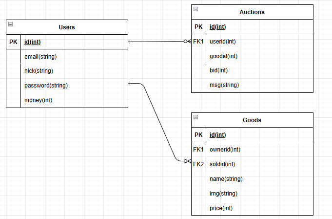
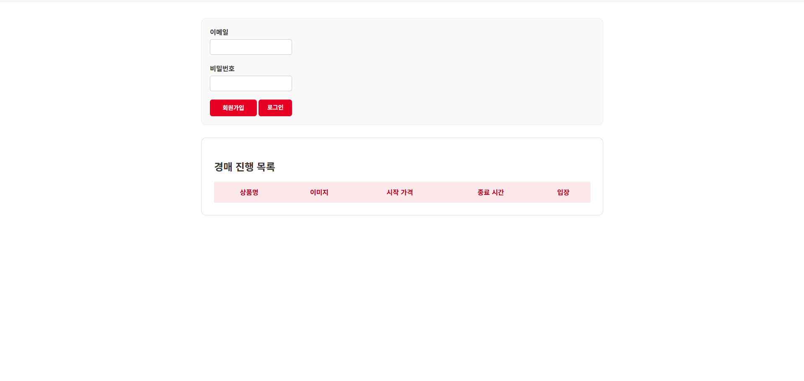
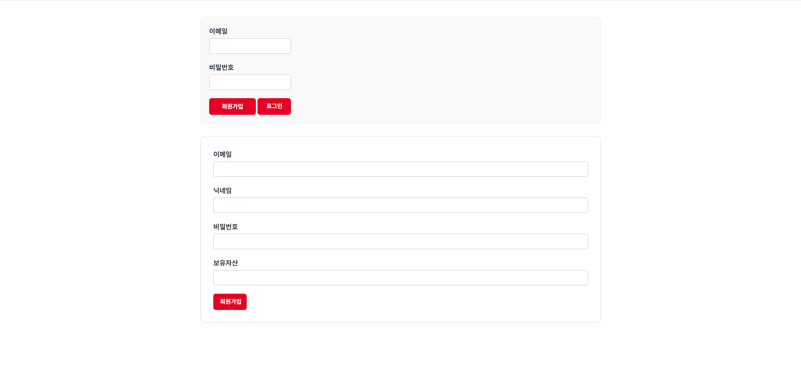
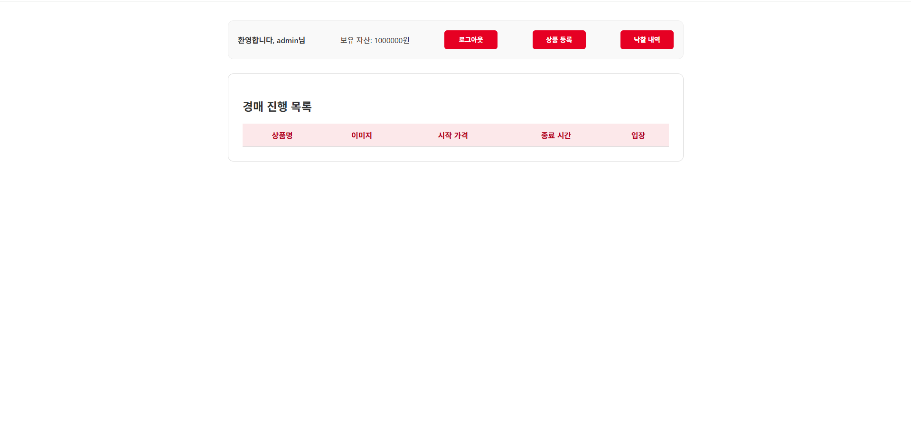
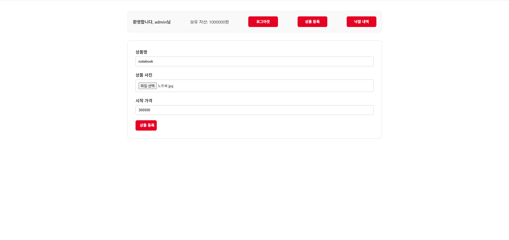
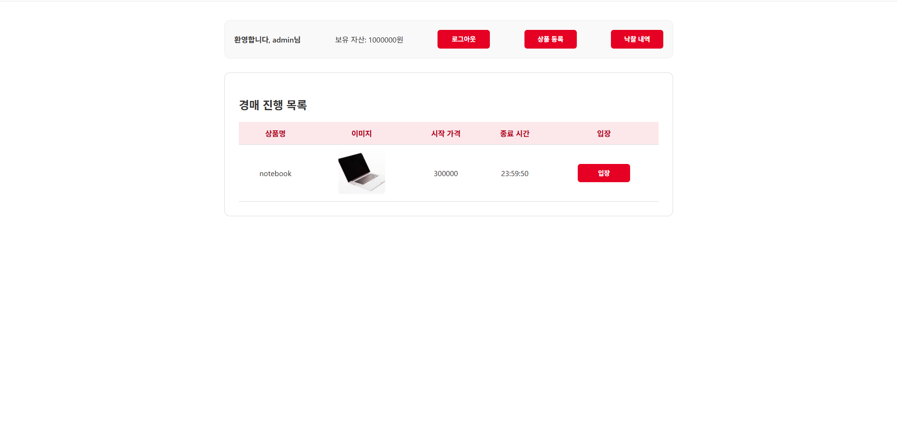
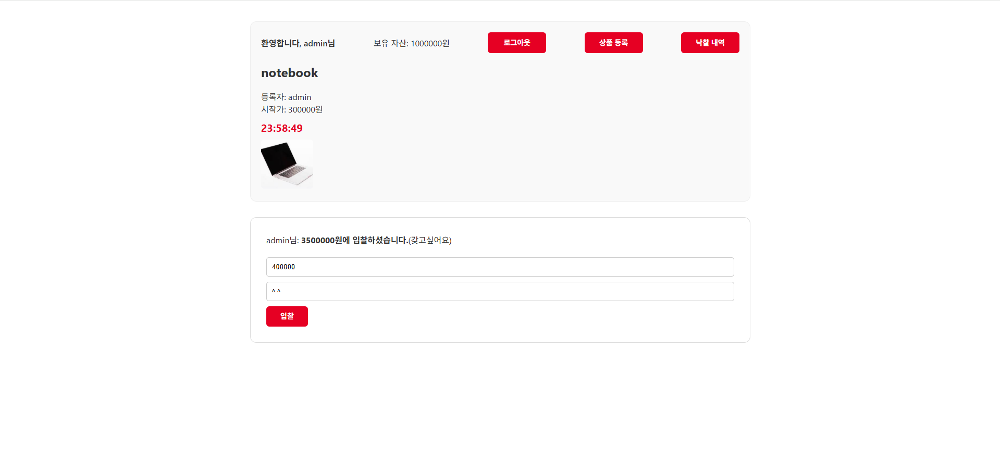

# NodeAuction - 실시간 경매 플랫폼

Node.js 기반의 실시간 온라인 경매 웹 애플리케이션입니다.   
사용자는 회원가입 후 상품을 등록하고, 다른 사용자들과 실시간으로 입찰 경쟁을 할 수 있으며 
입찰 시 채팅 기능을 지원합니다.

---
## ER 다이어그램
 
- Users 테이블: 회원정보 저장 
- Goods 테이블 : 회원이 업로드한 상품 정보 저장 (상품 정보, 낙찰자, 등록자 포함)
- Auctions 테이블 : 입찰 기록 저장 (입찰가, 메시지 포함)

---

## 주요 기능

| 기능 | 설명 |
|------|------|
| 회원가입 / 로그인 | 이메일, 닉네임, 비밀번호 기반 사용자 인증 (bcrypt + Passport) |
| 상품 등록 | 상품명, 이미지, 시작가 입력 → 등록된 상품은 24시간 동안 경매 가능 |
| 실시간 경매 | 실시간 입찰 기능 (Socket.IO 사용), 24시간 후 자동 낙찰 처리 |
| 낙찰 목록 조회 | 내가 낙찰받은 상품들을 별도 페이지에서 확인 가능 |
| 이미지 업로드 | Multer 기반 이미지 업로드 (5MB 제한) |
| 스케줄링 | Node-schedule로 24시간 경과 시 낙찰 자동 처리 |
| 인증 미들웨어 | 로그인 여부에 따라 접근 가능 페이지 구분 |

## 화면 예시
메인 페이지 
 
 
회원가입
 
 
로그인 성공 
 
상품 등록 
 
 
상품 목록 
 
 
경매방 입장 
 
 
